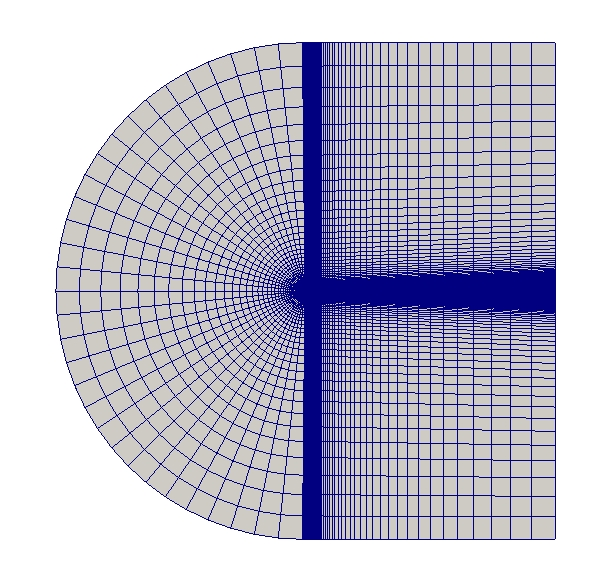

# External Mesh Generator

Read and convert meshes generated with external mesh generators

---

PyHOPE internally utilizes [Gmsh](https://gmsh.info) for the initial mesh generation and conversion before switching to its internal representation. The internal representation is loosely based on [meshio](https://github.com/nschloe/meshio) but augmented with additional information required for high-order meshes. This allows to read and convert meshes generated with external mesh generators such as ANSA, Gmsh, or Cubit.

!!! info
    PyHOPE currently comes with a patched version of Gmsh which includes a fix for serendipity elements and the internal CGNS updated to version to `v4.5`. While PyHOPE can work with the upstream version of Gmsh, it is recommended to use the provided patched version. Future releases of Gmsh might include the required fixes.

## File Formats

An external mesh is specified via the `3`/`external` mesh generation `Mode` in the [parameter file](../parameter-file.md), combined with one or more mesh `FileName`. The file format is automatically detected based on the file extension. Files might be read through Gmsh or internal readers. If multiple files are specified, they are merged into a single mesh. In this case, it is assumed that the meshes do not overlap and that the boundary information is consistent across the files. File formats supported and regularly tested during Continuous Integration (CI) are listed in the table below.

| File Format                             | Extension                            | Reader                                   |
| ----------------------------------------| -------------------------------------| ---------------------------------------- |
| GMSH ASCII/Binary                       | `.msh`                               | Gmsh                                     |
| CFD General Notation System (CGNS)      | `.cgns`                              | Gmsh + Internal<a href="#fn1" id="fnref1">¹</a>     |
| High Order Preprocessor (HOPR)          | `.h5`                                | Internal                                 |
| Gambit Neutral File (GNF)               | `.neu`                               | Internal<a href="#fn2" id="fnref2">²</a> |

<a href="#fnref1" id="fn1">¹</a> PyHOPE requires additional boundary information to read CGNS files through Gmsh. An internal reader is called after Gmsh to extract the required information.

<a href="#fnref2" id="fn2">²</a> PyHOPE uses its own internal reader for GNF files as the reader contained in Gmsh currently does not support all required features.

## Mesh Curving

{ width='300', loading=lazy, align=right }
PyHOPE understands curved meshes of arbitrary order if the external mesh generator provided already curved mesh. PyHOPE reads these meshes and directly uses their high-order information. Existing high-order meshes from other sources can thus be directly translated into the HDF5 format. Furthermore, available post-processing capabilities can be applied to these meshes. If more than one external mesh file is specified, each mesh is interpolated to the desired order specified via the `NGeo` parameter in the [parameter file](../parameter-file.md).

### Curving through Agglomeration

PyHOPE can utilize the agglomeration approach provided by Gmsh to curve linear meshes. In this case, the external mesh generator is used to generate a linear mesh, which is then curved through agglomeration in Gmsh before being read into PyHOPE. To use this approach, set the `NGeo` parameter in the [parameter file](../parameter-file.md) to the desired order larger than `1`. 

## Generation of Hexahedral Meshes
Many solvers require purely hexahedral meshes. PyHOPE can convert meshes consisting of tetrahedra, prisms and hexahedra into purely hexahedral meshes through a subdivision strategy. This feature is activated using the parameter `splitToHex=T`. Note, that pyramids cannot be decomposed to hexahedra in a straightforward way, thus this feature cannot be applied to meshes containing pyramids. Also note that this option is currently limited to `NGeo` \(\in\{1,2,4\}\).
