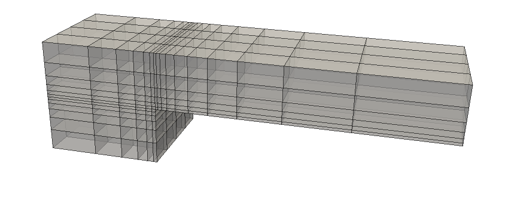

# Internal Mesh Generator

A simple internal mesh generator for generating curved meshes of basic block-structured geometries

---

The internal generator creates structured, block-wise meshes (Cartesian boxes) with options for multi-zone setups, periodic couplings, and graded (stretched) element distributions.

## Mesh Specification

Internal meshes are specified using exclusively the [INI parameter file format](../parameter-file.md). As internal meshes are created using zones with 8 corner nodes, each zone is limited to a Cartesian box geometry (before mesh post-processing). The following minimal parameter file can be found in `tutorials/1-01-cartbox` and generates a simple Cartesian box mesh.

```ini
!================================================================================================================================= !
! OUTPUT
!================================================================================================================================= !
ProjectName  = 1-01-cartbox                         ! Name of output files
OutputFormat = HDF5                                 ! Mesh output format [HDF5 VTK GMSH]

!================================================================================================================================= !
! MESH
!================================================================================================================================= !
Mode         = 1                                    ! Mode for Cartesian boxes
nZones       = 1                                    ! Number of boxes
Corner       = (/0.,0.,0. ,,1.,0.,0. ,,1.,1.,0. ,,  0.,1.,0.,, 0.,0.,1. ,,1.,0.,1. ,,1.,1.,1. ,,  0.,1.,1. /)
                                                    ! Corner node positions: (/ x_1,y_1,z_1, x_2,y_2,z_2,..... , x_8,y_8,z_8/)
nElems       = (/8,8,8/)                            ! Number of elements in each direction
BCIndex      = (/1,2,3,4,5,6/)                      ! Indices of boundary conditions for six boundary faces (z-,y-,x+,y+,x-,z+)
ElemType     = 108                                  ! Element type (104: Tetrahedra, 105: Pyramid, 106: Prism, 108: Hexahedral)
nGeo         = 9

!================================================================================================================================= !
! BOUNDARY CONDITIONS
!================================================================================================================================= !
BoundaryName = BC_zminus                            ! BC index 1 (from position in parameterfile)
BoundaryType = (/4,0,0,0/)                          ! (/ Type, curveIndex, State, alpha /)
BoundaryName = BC_yminus                            ! BC index 2
BoundaryType = (/2,0,0,0/)
BoundaryName = BC_xplus                             ! BC index 3
BoundaryType = (/2,0,0,0/)
BoundaryName = BC_yplus                             ! BC index 4
BoundaryType = (/2,0,0,0/)
BoundaryName = BC_xminus                            ! BC index 5
BoundaryType = (/2,0,0,0/)
BoundaryName = BC_zplus                             ! BC index 6
BoundaryType = (/9,0,0,0/)
```
!!! info
    Mesh output in VTK / Gmsh format is provided mainly for visualization purposes and might not support all high-order features.

### Multiple Cartesian Boxes

{ width='300', loading=lazy, align=right }
PyHOPE supports multi-zone setups consisting of multiple Cartesian boxes. Each box, refered to as zone, is defined by its 8 corner nodes specified in the `Corner` vector. The number of elements in each direction for each box is specified in the `nElems` vector. If boxes are connected with each other, the corner nodes of the touching element faces must either be identical or be placed on the center of the element edge (non-conforming interfaces with hanging nodes).

## Boundary Conditions

Boundary conditions are specified in the parameter file using the `BoundaryName` and `BoundaryType` keywords. The order of the boundary conditions is determined by the order of the boundary faces given as `z-,y-,x+,y+,x-,z+` inside the `BCIndex` vector. Indices can be applied repeatedly.

### Periodic Boundary Conditions

Boundary faces can be coupled periodically by specifying the `BoundaryType = (/1,0,0,-1/)` where the last entry `alpha` specifies the periodic displacement vector to be used. A negative alpha corresponds to a displacement vector applied in the opposite direction. Displacement vectors are indexed in the order of appearance in parameter file. The following minimal parameter file can be found in `tutorials/1-02-cartbox-periodic` and generates a Cartesian box mesh with periodic coupling in x- and y-direction.

```ini
!================================================================================================================================= !
! OUTPUT
!================================================================================================================================= !
ProjectName  = 1-02-cartbox_periodic                ! Name of output files
Debugvisu    = F                                    ! Launch the GMSH GUI to visualize the mesh
OutputFormat = HDF5                                 ! Mesh output format (HDF5 VTK)

!================================================================================================================================= !
! MESH
!================================================================================================================================= !
Mode         = 1                                    ! Mode for Cartesian boxes
nZones       = 1                                    ! Number of boxes
Corner       = (/0.,0.,0. ,,1.,0.,0. ,,1.,1.,0. ,,  0.,1.,0.,, 0.,0.,1. ,,1.,0.,1. ,,1.,1.,1. ,,  0.,1.,1. /)
                                                    ! Corner node positions: (/ x_1,y_1,z_1, x_2,y_2,z_2,..... , x_8,y_8,z_8/)
nElems       = (/2,3,4/)                            ! Number of elements in each direction
BCIndex      = (/1,3,6,4,5,2/)                      ! Indices of boundary conditions for six boundary faces (z-,y-,x+,y+,x-,z+)
ElemType     = 108                                  ! Element type (108: Hexahedral)
doFEMConnect = T                                    ! Generate finite element method (FEM) connectivity

!================================================================================================================================= !
! BOUNDARY CONDITIONS
!================================================================================================================================= !
BoundaryName = BC_zminus                            ! BC index 1 (from position in parameterfile)
BoundaryType = (/1,0,0,1/)                          ! (/ Type, curveIndex, State, alpha /)
BoundaryName = BC_zplus                             ! BC index 2
BoundaryType = (/1,0,0,-1/)                         ! here the direction of the vector 1 is changed, because it is the opposite side
vv = (/0.,0.,1./)                                   ! vector for periodic BC in z direction (zminus,zplus), index=1

BoundaryName = BC_yminus                            ! BC index 3
BoundaryType = (/1,0,0,2/)
BoundaryName = BC_yplus                             ! BC index 4
BoundaryType = (/1,0,0,-2/)                         ! (/ BCType=1: periodic, 0, 0, Index of second vector vv in parameter file /)
vv = (/0.,1.,0./)                                   ! vector for periodic BC in y direction (yminus,yplus), index=2

BoundaryName = BC_inflow                            ! BC index 5
BoundaryType = (/2,0,0,0/)
BoundaryName = BC_outflow                           ! BC index 6
BoundaryType = (/2,0,0,0/)
```

## Stretching Functions

By default, elements are distributed uniformly in each direction within each transfinite mesh zone. Stretching (grading) of the element distribution used to generate a mesh consisting of boxes with a stretched element arrangement. The following parameters control the stretching and are defined for each zone separately.

<dl class="aligned-list">
    <dt><code>StrechType</code>:</dt>
    <dd>Stretching type. Possible values are <code>0</code> (no stretching, uniform element distribution), <code>1</code> (stretching with progression factor), <code>2</code> (stretching with a length ratio) and <code>3</code> (stretching with a bell function).</dd>
    <dt><code>factor</code>:</dt>
    <dd>Stretching factor. Values > 1.0 lead to an exponential increase of the element size in the respective direction, values < 1.0 lead to an exponential decrease of the element size in the respective direction. A value of 1 has no effect on the element sizes, and a value of 0 disables the stretching function for this axis. Furthermore, the stretching behavior can be mirrored by adding a negative sign to the values. A combination with the parameter <code>l0</code> ignores the element number of the defined box.</dd>
    <dt><code>l0</code>:</dt>
    <dd>Length scale. The length of the first element of a stretched element arrangement of a Cartesian box. Each component of the vector represents an axis of the Cartesian coordinate system. A value of 0 disables the stretching function for that axis. A negative sign defines the length of the first element of the other side of the box. A combination with the parameter <code>factor</code> ignores the element number of the defined box.</dd>
    <dt><code>DXmaxToDXmin</code>:</dt>
    <dd>Frame ratio. The ratio of the largest to the smallest element size in the respective direction. If the <code>stretchType</code> vector component for an axis is <code>3</code>, the element arrangement is controlled by <code>DXmaxToDXmin</code> instead of the parameter <code>fac</code>.</dd>
</dl>

### Calculation Formulas

The stretching functions are applied in each direction independently. The following formulas are used to calculate the element sizes and positions.

- Calculation of the element size for `stretchType=1`:

\[ {\Delta x_{i+1} = f \cdot \Delta x_{i} f = \left(\frac{\Delta x_{max}}{\Delta x_{min}} \right)^{1/(nElems - 1)} } \]

- Calculation of the element size for `stretchType=3`:

\[ \Delta x(\xi) \sim 1 + \left( \frac{\Delta x_{max}}{\Delta x_{min}}-1\right)\cdot \left( \frac{\exp[-(\xi \cdot f)^2] - \exp[-f^2]}{\exp[0] - \exp[-f^2]}\right) \]

## Post-Deformation

Mesh zones can be deformed after the initial mesh generation using a set of pre-defined deformation functions. The resulting curved multi-block mesh is composed of of several structured boxes, which are first assembled and then globally mapped to a curved domain.

<dl class="aligned-list">
    <dt><code>convtest</code>:</dt>
    <dd>Convergence test mapping. A simple sinusoidal deformation in all directions to test the convergence behavior of high-order methods on curved meshes.</dd>
    <dt><code>cylinder</code>:</dt>
    <dd>A cylindrical mapping. The 2D square region is mapped to a cylindrical or toroidal coordinate system.</dd>
    <dt><code>sphere</code>:</dt>
    <dd>A spherical mapping. The 3D cubic region is mapped to a spherical coordinate system inside \([-1, 1]^3\).</dd>
    <dt><code>phill</code>:</dt>
    <dd>Periodic hill mapping. A 2D mapping to generate an extruded periodic hill geometry.</dd>
</dl>
